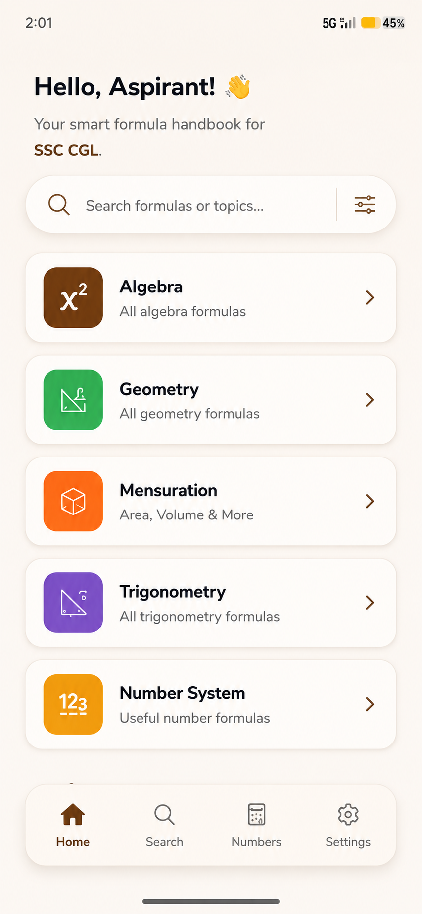
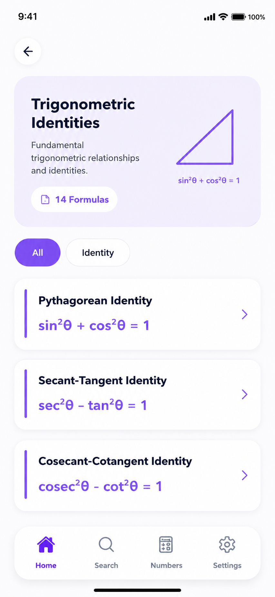
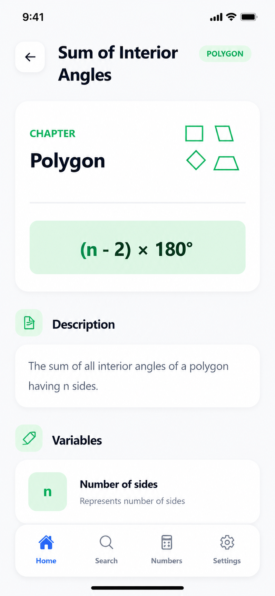
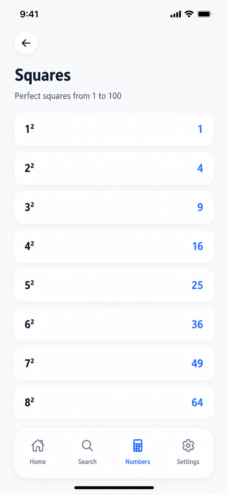

<h1 align="center">FormulaIQ – Smart Mathematics Formula & Revision Companion</h1>

<p align="center">

</p>

<p align="center">
<strong>Learn faster. Revise smarter. Master mathematics with FormulaIQ.</strong>
<br><br>
Explore essential formulas • Review mathematical concepts • Practice useful number references • Prepare for competitive exams.
</p>

<p align="center">
<a href="https://expo.dev/accounts/mohith1532/projects/formulaiq/builds/98a8544c-94eb-49bc-a79b-87955959fd57">

</a>
</p>

---

## 📑 Table of Contents

* 🚀 [Overview](#-overview)
* ✨ [Features](#-features)
* 🛠️ [Tech Stack](#️-tech-stack)
* 🏗️ [Architecture](#️-architecture)
* 📂 [Project Structure](#-project-structure)
* 📚 [Mathematics Content](#-mathematics-content)
* 📸 [Screenshots](#-screenshots)
* ⚙️ [Installation](#️-installation)
* 📦 [Build & Deployment](#-build--deployment)
* 🔮 [Future Work](#-future-work)
* 🤝 [Contributing](#-contributing)
* 📄 [License](#-license)
* 👨‍💻 [Author](#-author)

---

# 🚀 Overview

FormulaIQ is a **React Native mathematics reference application** built with Expo to help students quickly learn, revise, and recall important mathematical formulas and concepts.

The app organizes mathematical content into structured subjects and chapters, providing formula explanations, examples, notes, variable definitions, visual illustrations, and useful mathematical references in a clean and intuitive mobile interface.

FormulaIQ is particularly useful for **competitive exam preparation**, quick revision, and everyday mathematical reference.

The application works with locally bundled mathematical content, making formulas and references available without requiring a backend server.

---

# ✨ Features

> 📚 **Formula Library** — Browse formulas organized by subjects and chapters.

> 🔢 **Useful Numbers** — Quickly access squares, cubes, prime numbers, standard angles, and trigonometric values.

> 🔍 **Smart Search** — Search formulas, chapters, subjects, and mathematical concepts quickly.

> 📖 **Detailed Formula Pages** — View descriptions, examples, notes, and variable explanations for formulas.

> 🎨 **Visual Learning** — Learn mathematical concepts using custom illustrations and SVG diagrams.

> 📐 **Geometry References** — Explore 2D and 3D shapes with their mathematical properties.

> 📊 **Trigonometry Tables** — Quickly reference standard trigonometric values and identities.

> 🧠 **Chapter-Based Learning** — Navigate mathematics through structured subjects and chapters.

> ⚡ **Offline Access** — Core mathematical content is bundled directly with the application.

> 🌗 **Theme Support** — Switch between light and dark themes through the application settings.

> 📱 **Cross-Platform** — Built with React Native and Expo for mobile platforms.

---

# 🛠️ Tech Stack

| Category                | Technologies                                |
| ----------------------- | ------------------------------------------- |
| 📱 **Framework**        | React Native • Expo                         |
| 🧭 **Navigation**       | React Navigation                            |
| 🧠 **State Management** | React Context API                           |
| 📦 **Data**             | Local JSON                                  |
| 🎨 **UI & Graphics**    | React Native SVG • Custom SVG Illustrations |
| 🔎 **Search**           | Local Search Service                        |
| 💾 **Storage**          | Local Application Data                      |
| 🚀 **Build**            | Expo EAS                                    |

---

# 🏗️ Architecture

```text
                       ┌─────────────────────┐
                       │    FormulaIQ App    │
                       │   React Native      │
                       │       + Expo        │
                       └──────────┬──────────┘
                                  │
                    ┌─────────────▼─────────────┐
                    │        Navigation         │
                    ├───────────────────────────┤
                    │ Home                      │
                    │ Subjects                  │
                    │ Formula Lists             │
                    │ Formula Details           │
                    │ Search                    │
                    │ Useful Numbers            │
                    │ Settings                  │
                    └─────────────┬─────────────┘
                                  │
              ┌───────────────────▼───────────────────┐
              │              Services                 │
              ├───────────────────────────────────────┤
              │ Formula Service                       │
              │ Chapter Service                       │
              │ Numbers Service                       │
              │ Reference Service                     │
              │ Search Service                        │
              └───────────────────┬───────────────────┘
                                  │
                    ┌─────────────▼─────────────┐
                    │       Local Content       │
                    ├───────────────────────────┤
                    │ Subjects                  │
                    │ Chapters                  │
                    │ Formulas                  │
                    │ References                │
                    │ Useful Numbers            │
                    └───────────────────────────┘
```

---

# 📂 Project Structure

```text
FormulaIQ/
│
├── assets/
│   ├── app/
│   ├── branding/
│   ├── chapter-illustrations/
│   ├── robots/
│   ├── subjects/
│   └── *.png
│
├── src/
│   │
│   ├── components/
│   │   ├── common/
│   │   ├── formula/
│   │   ├── home/
│   │   ├── math/
│   │   ├── numbers/
│   │   ├── search/
│   │   ├── settings/
│   │   └── subject/
│   │
│   ├── constants/
│   │   ├── chapterIllustrations.js
│   │   ├── colors.js
│   │   ├── darkTheme.js
│   │   ├── lightTheme.js
│   │   ├── numberImages.js
│   │   ├── shapeIllustrations.js
│   │   └── subjectIcons.js
│   │
│   ├── context/
│   │   └── SettingsContext.js
│   │
│   ├── data/
│   │   ├── chapters/
│   │   ├── formulas/
│   │   ├── references/
│   │   ├── numbers.json
│   │   └── subjects.json
│   │
│   ├── illustrations/
│   │   ├── chapters/
│   │   ├── common/
│   │   ├── numbers/
│   │   ├── shapes/
│   │   └── subjects/
│   │
│   ├── navigation/
│   │   ├── AppNavigator.js
│   │   ├── BottomTabs.js
│   │   ├── HomeStack.js
│   │   └── NumbersStack.js
│   │
│   ├── screens/
│   │   ├── FormulaDetail/
│   │   ├── FormulaList/
│   │   ├── Home/
│   │   ├── Search/
│   │   ├── Settings/
│   │   ├── Splash/
│   │   ├── Subject/
│   │   └── UsefulNumbers/
│   │
│   └── services/
│       ├── chapterService.js
│       ├── formulaService.js
│       ├── numbersService.js
│       ├── referenceService.js
│       └── searchService.js
│
├── App.js
├── app.json
├── eas.json
├── index.js
├── package.json
├── AGENTS.md
└── CLAUDE.md
```

---

# 📚 Mathematics Content

FormulaIQ currently organizes mathematical content into five major areas:

| Subject              | Coverage                                                                               |
| -------------------- | -------------------------------------------------------------------------------------- |
| 🔢 **Number System** | Divisibility, Factors, HCF & LCM, Prime Numbers, Remainders, Squares & Cubes           |
| ➗ **Algebra**        | Identities, Indices & Surds, Progressions, Quadratic Equations, Simplification         |
| 📐 **Geometry**      | Lines & Angles, Triangles, Quadrilaterals, Circles, Coordinate Geometry, Constructions |
| 📏 **Mensuration**   | Plane Figures, Surface Area, Volume                                                    |
| 📐 **Trigonometry**  | Ratios, Identities, Properties, Heights & Distances                                    |

### Additional References

* 🔢 Squares
* 🔢 Cubes
* 🔢 Prime Numbers
* 📐 Standard Angles
* 📊 Trigonometric Values
* 🔺 2D Geometric Shapes
* 🧊 3D Geometric Shapes

---

# 📸 Screenshots

<p align="center">
  
  
  
  
  
</p>

---

# ⚙️ Installation

### 1. Clone the Repository

```bash
git clone https://github.com/yourusername/FormulaIQ.git
cd FormulaIQ
```

### 2. Install Dependencies

```bash
npm install
```

### 3. Start the Expo Development Server

```bash
npx expo start
```

You can then run the application using:

```bash
npx expo start --android
```

or:

```bash
npx expo start --ios
```

---

# 📦 Build & Deployment

FormulaIQ uses **Expo Application Services (EAS)** for building Android and iOS applications.

### Install EAS CLI

```bash
npm install -g eas-cli
```

### Login to Expo

```bash
eas login
```

### Build Android Preview APK

```bash
eas build --platform android --profile preview
```

### Build Android Production Version

```bash
eas build --platform android --profile production
```

### Build for iOS

```bash
eas build --platform ios --profile production
```

After the build completes, EAS provides the generated build through the Expo dashboard.

---

# 🔮 Future Work

The following features can be added in future versions of FormulaIQ:

* 🧮 **Practice Questions** — Add topic-wise mathematical questions.
* ⏱️ **Timed Practice** — Introduce timed formula and aptitude quizzes.
* 📊 **Progress Tracking** — Track revision and learning progress.
* ⭐ **Bookmarks** — Allow users to save frequently used formulas.
* 📝 **Personal Notes** — Add notes to individual formulas.
* 🔄 **Revision Mode** — Create quick revision sessions from selected chapters.
* 🧠 **AI Problem Solver** — Provide step-by-step solutions to mathematical problems.
* 📚 **Exam Mode** — Add dedicated preparation modules for competitive examinations.
* 🔔 **Revision Reminders** — Notify users when formulas are due for revision.

---

# 🤝 Contributing

Contributions are welcome and appreciated!

### 1. Fork the Repository

Fork the FormulaIQ repository to your GitHub account.

### 2. Clone Your Fork

```bash
git clone https://github.com/yourusername/FormulaIQ.git
cd FormulaIQ
```

### 3. Create a Feature Branch

```bash
git checkout -b feature/your-feature-name
```

### 4. Make Your Changes

Implement your feature and test it locally.

```bash
npm install
npx expo start
```

### 5. Commit Your Changes

```bash
git add .
git commit -m "Add: your feature description"
```

### 6. Push Your Branch

```bash
git push origin feature/your-feature-name
```

### 7. Open a Pull Request

Open a Pull Request from your feature branch to the `main` branch and describe your changes.

---

# 📄 License
FormulaIQ is licensed under the **MIT License** 
see the[`LICENSE`](LICENSE) file for more information.

---

# 👨‍💻 Author

### Mohith Reddy

**Full Stack Developer • React Native Developer • B.Tech CSE (2026)**

Passionate about building modern full-stack and mobile applications with **React Native, Node.js, Express.js, MongoDB, and AI-powered technologies**.
